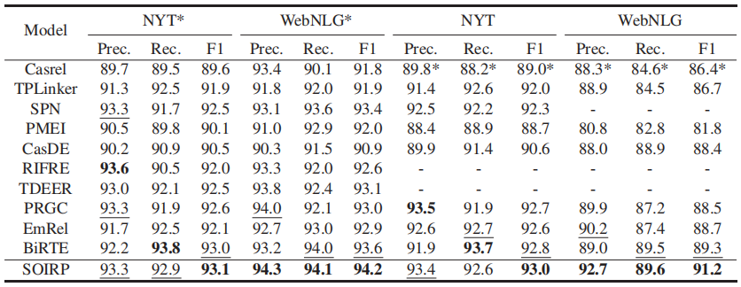

##  SOIRP: Subject-Object Interaction and Reasoning Path Based Joint Relational Triple Extraction by Table Filling.


## Requirements
The dependency packages can be installed with the command:
```
pip install -r requirements.txt
```
## Datasets  
  
- [NYT*](https://github.com/weizhepei/CasRel/tree/master/data/NYT) and [WebNLG*](https://github.com/weizhepei/CasRel/tree/master/data/WebNLG)(following [CasRel](https://github.com/weizhepei/CasRel))  
- [NYT](https://drive.google.com/file/d/1kAVwR051gjfKn3p6oKc7CzNT9g2Cjy6N/view)(following [CopyRE](https://github.com/xiangrongzeng/copy_re))  
- [WebNLG](https://github.com/yubowen-ph/JointER/tree/master/dataset/WebNLG/data)(following [ETL-span](https://github.com/yubowen-ph/JointER))  
  
Or you can just download our preprocessed [datasets](https://drive.google.com/file/d/1ySRSN0EkQ4Qdi-VIQnwfJwofV6AJe9Bs/view?usp=drive_link).

## Usage
* **Get pre-trained BERT model**
Download [BERT-BASE-CASED](https://huggingface.co/bert-base-cased) and put it under `./pretrained`.

* **Train and select the model**
```
python run.py --dataset=WebNLG  --train=train
python run.py --dataset=WebNLG_star   --train=train
python run.py --dataset=NYT   --train=train
python run.py --dataset=NYT_star   --train=train
```

* **Evaluate on the test set**
```
python run.py --dataset=WebNLG  --train=test
python run.py --dataset=WebNLG_star   --train=test
python run.py --dataset=NYT   --train=test
python run.py --dataset=NYT_star   --train=test
```
## Main results

The average results of our model throughout the three runs with various random seeds are reported here to demonstrate the reliability and generalizability of our model.
## Pre-trained Models
### Download Links
Pre-trained models with three runs using various random seeds can be downloaded via the following download links.
| Dataset | File Size | Download |
| ------- | ------- | ------- |
| **NYT** | 472.3MB | [model1](https://drive.google.com/file/d/1l1tNPdCVEBurgWRvr1KvTyzgTtHeoOeK/view?usp=drive_link) [model2](https://drive.google.com/file/d/1n8LPdrlPLMsLvmNflPKANts5Pcq2gtCw/view?usp=drive_link) [model3](https://drive.google.com/file/d/1Am38cvxic3MDbl4k9-1HTlJ12rW3ptz0/view?usp=drive_link) |
| **NYT_star** | 472.3MB | [model1](https://drive.google.com/file/d/18S8DHiNkZAINfHdt0HoC_dlyUFMFj0ML/view?usp=drive_link) [model2](https://drive.google.com/file/d/1E-M_UWHDhR3pzSsefNz5fTx9G_2JwFpp/view?usp=drive_link) [model3](https://drive.google.com/file/d/1i5JrGBBongRiCk8GLruZgFL61vtV6o5a/view?usp=drive_link)  |
| **WebNLG** | 475.7MB | [model1](https://drive.google.com/file/d/143ydHpVh50_Hb1Ywh9zANVikN4bBChCs/view?usp=drive_link) [model2](https://drive.google.com/file/d/1ne8IRq3xT-D4KcVdHhgb2xaZ38JRpkKf/view?usp=drive_link) [model3](https://drive.google.com/file/d/1IK0wHKZboJIFfr6miBlCHZewst0wGpQW/view?usp=drive_link)  |
| **WebNLG_star** | 474.9MB | [model1](https://drive.google.com/file/d/10ZM4S5uqpLQYUdcMPSrba6p7mzire1Um/view?usp=drive_link) [model2](https://drive.google.com/file/d/159i0jytGMRiBIh_ZGSzWG6KtmBKnWDDW/view?usp=drive_link) [model3](https://drive.google.com/file/d/1Bs9_60ZwO36GbKB2pqVcsLk-OYP57aAq/view?usp=drive_link)  |


### Acknowledgement
Parts of our codes come from [bert4keras](https://github.com/bojone/bert4keras).
